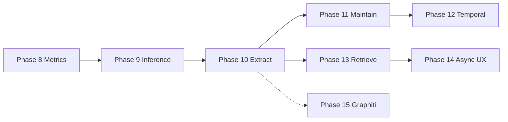

# MiroFish-Offline — Zep / Graphiti–Style Memory Roadmap

## Overview

Post-migration enhancement plan: strengthen **knowledge-graph ingestion**, **entity/relation quality**, **retrieval**, **temporal memory**, and **operations** using patterns from **Zep** and **Graphiti**, while **keeping Neo4j** as the graph store. Graphiti is an **application layer** reference (extract, merge, time, search)—not a replacement for Neo4j.

**Execution order (summary):** Phase 8 → 9 → (10A+10C) → measure → 10B → 11 → 13 → 12 → 14 → optional 15.

**Prerequisites:** Migration phases in `progress.md` (Phases 0–6 complete; Phase 7 publish optional).

---

## PHASE 8 — Baseline, metrics, and guardrails (TODO)

**Goal:** Measure whether each change improves density, reliability, or latency.

- **TASK-020**: Define KPIs for graph build—entities/chunk, relations/chunk, edge-to-node ratio, JSON parse failure rate, mean chunk latency; log tokens if available from LLM/server
- **TASK-021**: Add structured ingest logging after `add_text`—`len(entities)`, `len(relations)`, chunk char count, warnings when near `max_tokens` / suspected truncation
- **TASK-022**: Create a **golden set** (2–3 fixed documents + ontology); script or runbook to re-run after each phase and snapshot node/edge counts
- **TASK-023**: Document config checklist in `.env.example` / internal runbook—`LLM_*`, `GRAPH_CHUNK_SIZE`, `GRAPH_CHUNK_OVERLAP`, `NER_MAX_OUTPUT_TOKENS`, Ollama `OLLAMA_NUM_CTX` / LM Studio context vs prompt+chunk size

---

## PHASE 9 — Inference stack (TODO)

**Goal:** Remove the main ceiling on extraction quality and JSON completeness.

- **TASK-024**: Support optional **dedicated** LLM model/base URL for NER/RE only (strong extract vs cheap chat), wired through `Config` and `NERExtractor` / `LLMClient`
- **TASK-025**: Tune `NER_MAX_OUTPUT_TOKENS` using golden set until `relations` arrays stop being cut off; document safe ranges per model
- **TASK-026**: Verify input context—server `num_ctx` (Ollama) or LM Studio context ≥ ontology + chunk; add startup warning or doc if mismatch risks silent truncation
- **TASK-027**: Prefer structured JSON/schema where provider supports it; optional **JSON repair** retry path in `LLMClient.chat_json` or `NERExtractor`

---

## PHASE 10 — Extraction pipeline (TODO)

**Goal:** Split work so relations are not starved; improve cross-chunk linking and provenance.

### 10A — Two-pass extraction

- **TASK-028**: Implement Pass 1—entities (+ attributes) only; stable JSON shape
- **TASK-029**: Implement Pass 2—same text + frozen entity list → relations only; ontology relation types + coverage of explicit dependencies (`NER_TWO_PASS` or `GraphIngestionPipeline` + `neo4j_storage.add_text`)

### 10B — Graph-aware linking

- **TASK-030**: Before/after Pass 2, retrieve top-K existing entities per `graph_id` (vector similarity to chunk via `SearchService` or Cypher); inject short candidate list into prompt for supported links

### 10C — Chunking

- **TASK-031**: Env or preset profiles for chunk size/overlap per model tier; keep overlap ~6–10% of chunk size (`config.py`, `file_parser.split_text_into_chunks`)
- **TASK-032** (optional): Semantic chunk boundaries (headings/paragraphs) layered on character caps in `file_parser.py`

### 10D — Episode provenance

- **TASK-033**: Add episodic subgraph edges—`(Episode)-[:MENTIONS]->(Entity)` and/or links to facts; extend `neo4j_schema.py` and `Neo4jStorage.add_text`

---

## PHASE 11 — Graph maintenance (merge graph) (TODO)

**Goal:** Fewer duplicates, canonical entities, controlled edge growth.

- **TASK-034**: Deterministic entity normalization (strings, optional alias table / acronyms)
- **TASK-035**: Embedding-based candidate retrieval for new entities → merge or `SAME_AS` above threshold
- **TASK-036**: Batched LLM adjudication for ambiguous pairs only (“same real-world entity?”)
- **TASK-037**: Edge dedupe—`MERGE` or match on `(src, tgt, type, normalized fact)`; append `episode_ids` when reinforcing
- **TASK-038**: Background **entity summarization** from accumulated facts for high-traffic nodes (`graph_maintenance.py` or `services/`)

---

## PHASE 12 — Temporal memory (TODO)

**Goal:** Facts can update without deleting history.

- **TASK-039**: Contradiction policy—invalidate old `RELATION` (`invalid_at`/`valid_at`) and add new edge or version chain
- **TASK-040**: Optional LLM/metadata hints (`supersedes`, time expressions) on ingest
- **TASK-041**: Retrieval defaults—filter `invalid_at IS NULL` or support **as-of** queries for reports/simulations

---

## PHASE 13 — Retrieval and agent memory (TODO)

**Goal:** Richer context for `GraphToolsService`, `ReportAgent`, agent chat.

- **TASK-042**: Env-driven `SEARCH_VECTOR_WEIGHT` / `SEARCH_KEYWORD_WEIGHT` with sum-to-1 validation (`search_service.py`, `config.py`)
- **TASK-043**: Post–hybrid-search graph expansion—1–2 hops, degree caps, optional entity-type filters
- **TASK-044** (optional): Rerank top-M hits (cross-encoder or small LLM)
- **TASK-045** (optional): Cache query embeddings and hot subgraph reads per `graph_id` with TTL during long simulations

---

## PHASE 14 — Throughput, async jobs, and UX (TODO)

**Goal:** Resilient builds, visibility, controlled concurrency.

- **TASK-046**: **Job queue** for graph build—enqueue chunk batches, return `job_id`, persist status; API + UI poll (implements real `wait_for_processing` semantics if desired)
- **TASK-047**: Backpressure—max concurrent LLM calls; tie batch size to VRAM/CPU
- **TASK-048**: Admin/dashboard metrics—episodes processed, failed chunks, avg relations/chunk, merge stats

---

## PHASE 15 — Graphiti evaluation spike (TODO — optional)

**Goal:** Build-vs-adopt decision after Phases 9–10 land.

- **TASK-049**: Run [Graphiti](https://github.com/getzep/graphiti) on a copy of golden data with same LLM stack; compare density, dedupe, ops cost
- **TASK-050**: If adopting, document integration options (sidecar vs replace ingest only) and storage sync

---

## Execution flow (reference)

---

## Success criteria (acceptance examples)

- **Density:** Golden doc edge-to-node ratio improves materially without junk-edge explosion
- **Stability:** Lower JSON failure rate; no silent context truncation
- **Retrieval:** Better hit rate on manual/scripted eval for graph tools + reports
- **Operations:** Predictable build time; failed chunks visible and retryable

---

## Clarifications

- **Neo4j vs Graphiti:** Neo4j is the **database**. Graphiti names **patterns and optional software** for ingest/merge/time—not “switch DB to win.”
- **Code anchors:** `ner_extractor.py`, `neo4j_storage.py`, `neo4j_schema.py`, `graph_storage.py`, `search_service.py`, `llm_client.py`, `config.py`, `file_parser.py`, `graph_memory_updater.py`, `graph_builder.py`, `graph.py` (see paths under `backend/app/`).

---

## Planned new / touched files (tracking)

| File / area | Purpose | Status |
|-------------|---------|--------|
| `backend/app/storage/graph_maintenance.py` (new) | Dedupe, merge, summarization jobs | TODO |
| `backend/app/services/graph_ingestion_pipeline.py` (new, optional) | Two-pass + linking orchestration | TODO |
| `backend/app/storage/ner_extractor.py` | Two-pass, optional repair | TODO |
| `backend/app/storage/neo4j_storage.py` | Provenance edges, dedupe hooks | TODO |
| `backend/app/storage/neo4j_schema.py` | Episode–entity relations, indexes if needed | TODO |
| `backend/app/jobs/` or `services/graph_build_queue.py` (new) | Async build jobs | TODO |
| `docs/golden-set/` or `scripts/` | Regression assets + runner | TODO |

---

## Dependencies for prioritization

- GPU VRAM and whether ingest must stay on a small local model
- Primary corpus type (reports vs chat vs code)—chunking and eval differ
- Offline-only vs cloud OK for extraction-only endpoint
- Location of golden documents and who signs off on quality bars

---

# Addendum A — Improving analysis (quality of insights, not just graph size)

“Analysis” here means **trustworthy conclusions** from the graph + LLM stack: simulations, `ReportAgent`, `GraphToolsService` (insight_forge, panorama, interviews), and any post-build QA.

## A.1 Evaluation and ground truth

- **TASK-A01**: Maintain **golden questions** with expected entities/relations or “must cite” facts—automate precision/recall on graph answers where feasible
- **TASK-A02**: **Human rubric** (1–5) for report sections—groundedness, completeness, actionability; run before/after retrieval changes
- **TASK-A03**: Log **which edges/nodes** were retrieved for each tool call; store in debug mode for failure analysis

## A.2 Graph quality → analysis quality

- Denser, deduped graphs (Phases 10–11) directly improve tool hits; **temporal** correctness (Phase 12) stops contradictory evidence in one answer
- **Provenance** (Phase 10D) enables “show sources” in reports—reduces hallucinated glue between facts

## A.3 Report and tool prompts

- **TASK-A04**: Explicit **citation format** in prompts—require fact sentences or node names from retrieved context only
- **TASK-A05**: **Confidence gating**—if retrieval score below threshold, answer “insufficient graph evidence” instead of inventing bridges
- **TASK-A06**: Optional **second-pass critic** on draft report (small model or same model)—check unsupported claims vs retrieved bundle (cost/latency tradeoff)

## A.4 Simulation ↔ graph alignment

- **TASK-A07**: Compare `GraphMemoryUpdater` episode text to ontology—ensure action descriptions mention entities the NER can extract
- **TASK-A08**: Periodic **consistency check**—sample agents vs graph entities they should “know” from simulation memory

## A.5 Product analytics

- **TASK-A09**: Dashboards—tool call success rate, empty-search rate, avg evidence size per report section
- **TASK-A10**: A/B or version tags on prompt/pipeline versions to correlate with rubric scores

*Include or exclude Addendum A tasks in your backlog as you prefer; they are independent of Phases 8–15 but compound with better graphs and retrieval.*

---

# Addendum B — Async / concurrent LLM calls: will it be better?

**Short answer:** Async or **limited parallel** calls usually **improve wall-clock throughput** for graph builds and batch tools; they do **not** by themselves improve **per-chunk extraction quality**. Quality still comes from model, prompts, chunking, and multi-pass logic (Phases 9–10). Misconfigured parallelism can **hurt** stability (OOM, timeouts, nondeterministic ordering).

## B.1 Where concurrency helps

| Scenario | Benefit |
|----------|---------|
| **Many independent chunks** in one graph build | Overlap I/O + GPU wait; shorter total build time |
| **Embedding batches** | Often already batched; parallel **requests** can complement batch APIs |
| **Multiple graphs / users** | Throughput across tenants |
| **ReportAgent / multi-tool** | Parallel retrieval + LLM steps where dependencies allow |

## B.2 Where concurrency does not replace other work

- **Single long chunk**—one completion is still one completion; no gain from duplicate calls
- **Ordering-sensitive** writes—if merge logic assumes strict episode order, parallel ingest may need **per-graph serialization** or transactional merge (Phase 11)
- **VRAM-bound local GPU**—too many concurrent generations **queue or OOM**; optimal is often **small pool** (e.g. 1–2) not “N = chunk count”

## B.3 Risks and mitigations

- **Rate limits / server queue** (LM Studio, Ollama): many clients → timeouts; use **semaphore** + retries + jitter
- **Non-determinism**: parallel chunk completion order ≠ document order—**OK** if merges are commutative; **not OK** if you rely on “first wins” without merge rules
- **Debugging**: failures harder to reproduce—**structured job ids** and per-chunk logs (Phase 8) become essential

## B.4 Recommended direction for this fork

1. **Phase 8 metrics first**—measure p50/p95 chunk latency and failure rate **serially**
2. **Phase 9–10**—quality baseline before scaling concurrency
3. **Phase 14**—introduce **bounded worker pool** (env `GRAPH_LLM_MAX_CONCURRENT` or similar), optional **async job API** for UX; avoid unbounded `asyncio.gather` on all chunks
4. **Optional**: parallel **CPU** work (parsing, embedding prep) while GPU runs LLM—cheap win with same GPU concurrency cap

## B.5 Verdict

| Question | Answer |
|----------|--------|
| Will async always be “better”? | **No**—only better for **throughput** when hardware and merge semantics allow it |
| Should we plan it? | **Yes** in Phase 14 (queue + backpressure), **after** quality baselines |
| Default for local single-GPU? | **Low concurrency (1–2)** often optimal; measure before raising |

---

# Addendum C — Evidence base: is this roadmap direction sound?

This addendum maps the roadmap to **published research**, **public benchmarks**, and **industry practice**, and states **limits of correlation** (your stack is local LLMs + Neo4j; many papers use cloud APIs or different datasets).

**For challenges to these claims, precision–recall tradeoffs, and classical methods that *revise* the roadmap, see Addendum D (below).**

## C.1 Overall verdict

| Claim in roadmap | Support in literature / practice |
|------------------|--------------------------------|
| **Temporal KG + episodic memory for agents** (Zep-style) | Zep’s system paper is an **arXiv preprint** ([2501.13956](https://arxiv.org/abs/2501.13956)); treat benchmark claims as **internal/author-reported** until independently replicated. The **research question** (structured, time-aware memory vs flat context) is mainstream; the **exact numbers** are not general scientific law. |
| **LLMs for KG construction + ontology/schema guidance** | Surveys frame **LLM–KG interplay**: ontology generation, validation, QA, consistency—aligned with ontology-guided extraction (Phases 9–11). See Springer *Discover Artificial Intelligence* ([10.1007/s44163-024-00175-8](https://doi.org/10.1007/s44163-024-00175-8)) and the arXiv survey *Research Trends for the Interplay between Large Language Models and Knowledge Graphs* ([arXiv:2406.08223](https://arxiv.org/abs/2406.08223)). |
| **Splitting “structure” from “content” (two-pass / staged extraction)** | **Empirical support**: work on improving structured IE output finds **decoupling** structuring from raw generation helps NER/RE-style tasks; see [“A Simple but Effective Approach to Improve Structured Language Model Output for Information Extraction”](https://aclanthology.org/2024.findings-emnlp.295) (Findings of EMNLP 2024, [arXiv:2402.13364](https://arxiv.org/abs/2402.13364)). This **supports Phase 10A** conceptually (entities then relations), independent of Zep. |
| **Hybrid retrieval (dense + lexical/BM25)** | **Strong engineering consensus** and benchmark evidence: sparse and dense capture **complementary** errors; hybrid fusion often beats either alone on retrieval benchmarks such as **BEIR** ([BEIR paper](https://arxiv.org/abs/2104.08663)); see also ecosystem summaries on RRF / weighted fusion. **Supports Phase 13** (your 0.7/0.3 style blend is a standard starting point; tuning beats fixed weights). |
| **Graph structure for “global” QA / summaries** | **GraphRAG** (Microsoft Research) builds an entity graph, community structure, and summaries for query-focused summarization—showing **graphs + retrieval** help holistic questions where vector-only RAG is weak. See [From Local to Global: A Graph RAG Approach to Query-Focused Summarization](https://www.microsoft.com/en-us/research/publication/from-local-to-global-a-graph-rag-approach-to-query-focused-summarization/) and [GraphRAG project](https://microsoft.github.io/graphrag/). **Supports** richer graph density + community/summary ideas (related to Phase 11 entity summarization and Phase 13 expansion). |
| **Long-horizon memory evaluation** | **LongMemEval** ([arXiv:2410.10813](https://arxiv.org/abs/2410.10813), ICLR 2025) stresses **temporal reasoning**, **knowledge updates**, and **abstention**—directly relevant to **Phase 12** and **Addendum A** (analysis groundedness). Zep’s blog/paper claims improvements on this axis; treat **vendor-reported numbers** as **hypothesis-generating**, not independent proof of your fork’s gains. |
| **Entity resolution / deduplication (blocking, matching, canonicalization)** | **Established field**: end-to-end **entity resolution** surveys ([arXiv:1905.06397](https://arxiv.org/abs/1905.06397)) and **neural entity linking** surveys (e.g. [Semantic Web journal survey](https://doi.org/10.3233/SW-222986)) justify **staged** candidate generation + ranking + optional LLM adjudication (**Phase 11**). Graphiti’s MinHash/LSH-style ideas are **plausible engineering** in that tradition; exact choice should still be **measured on your data**. |
| **Structured outputs / JSON for extraction** | Provider APIs and recent IE papers push **schema-constrained** decoding; quality varies by model and task size. Treat **Phase 9** structured output as **best practice**, not a guarantee—keep **repair/retry** and golden-set checks. |
| **Async / parallel LLM calls** | **No universal paper** “async = smarter.” Throughput gains follow **queueing theory** and **GPU scheduling**; risks (OOM, ordering) are **systems** concerns. **Addendum B** remains the correct framing: measure after quality baselines. |

## C.2 What is *not* proven by citations here

- **Your** edge-to-node ratio target on **your** corpus with **your** local model is an **empirical** question—Phase 8 golden set is the right scientific move **on your fork**.
- **Zep vs MemGPT** numbers come from Zep’s paper/blog; replication on **Ollama + Neo4j** is **not** automatic.
- **Graphiti** as a library: open source and aligned with Zep’s story ([getzep/graphiti](https://github.com/getzep/graphiti)); adopting it is an **integration** decision, not a requirement for validity of the *concepts*.

## C.3 Correlation vs causation (how to use this doc)

1. **Literature** supports **which layers exist** (extract → store → retrieve → time → evaluate).  
2. **Your roadmap** orders **engineering work**; correlation with “better UX” requires **before/after metrics** (Phase 8, Addendum A rubrics).  
3. **Strongest causal levers** you can test locally: **model capacity**, **context/output limits**, **chunk boundaries**, **two-pass extraction**, **hybrid retrieval weights**, **dedupe**—each can be **ablated** on the golden set.

## C.4 Suggested reading order (for implementers)

1. [arXiv:2501.13956](https://arxiv.org/abs/2501.13956) — Zep / temporal KG for agent memory (big picture).  
2. [arXiv:2410.10813](https://arxiv.org/abs/2410.10813) — LongMemEval (what “good memory” benchmarks measure).  
3. [arXiv:2104.08663](https://arxiv.org/abs/2104.08663) — BEIR (why hybrid retrieval).  
4. [ACL 2024 Findings EMNLP structured IE paper](https://aclanthology.org/2024.findings-emnlp.295) — staged structuring for extraction.  
5. Microsoft **GraphRAG** publication + docs — graph communities and global retrieval.  
6. Entity resolution survey [arXiv:1905.06397](https://arxiv.org/abs/1905.06397) — dedupe pipeline vocabulary.

---

# Addendum D — Critical review: evidence that *challenges* the roadmap, and methodological upgrades

Addendum C asked what **supports** the plan. This addendum does the opposite: **contradictions, risks, and established methods** that should **tighten or revise** Phases 8–15. Preference is given to **mature venues and methods** (statistics, IR, ACL-affiliated proceedings, surveys); **arXiv-only** or very new workshop items are cited **with caveats** where they supply needed empirical warnings.

## D.1 Epistemic stance

The roadmap is a **set of engineering hypotheses**. Scientific backing requires:

1. **Pre-specified** metrics and stop rules (what would falsify an approach on your golden set).  
2. **Human adjudication** for relation and entity gold—generative RE evaluation is **not** reliably reduced to exact string match; [Wadhwa et al., ACL 2023 — *Revisiting Relation Extraction in the era of Large Language Models*](https://aclanthology.org/2023.acl-long.868/) argue for **human evaluation** alongside automated metrics.  
3. **Inter-annotator agreement** when more than one annotator exists; disagreement signals **ambiguous guidelines**, not only noise ([Kulick et al., EVENTS workshop 2014](https://aclanthology.org/W14-2904/) — *Inter-annotator Agreement for ERE annotation*).

**Implication:** Phase 8 is necessary but **insufficient** without a written **annotation guideline** and, where possible, **two annotators + κ / α** on a slice of the corpus.

---

## D.2 Challenge: “Two-pass extraction will fix sparse relations”

**Supporting evidence (decoupling helps):** [Wang et al., Findings EMNLP 2024](https://aclanthology.org/2024.findings-emnlp.295) — separating structuring from raw generation improves structured IE.

**Counter-evidence and limits:**

- **Robustness across data regimes:** [Swarup et al., COLING 2025 — *LLM4RE: A Data-centric Feasibility Study for Relation Extraction*](https://aclanthology.org/2025.coling-main.447/) report that **frontier LLMs are not uniformly robust** across relation-extraction data characteristics; **2100+** controlled experiments show **failure modes** persist. Two-pass reduces **coupling** in the *prompt*; it does not erase **domain shift**, **long-tail relations**, or **contextual ambiguity**.  
- **Benchmark quality:** [Zhou et al., Findings ACL 2024 — *The State of Relation Extraction Data Quality*](https://aclanthology.org/2024.findings-acl.470/) show **label errors and weak distant supervision** are widespread; **larger datasets ≠ better evaluation**. Improving extraction on **noisy gold** optimizes the wrong target.

**Roadmap revision:** Treat Phase 10A as **necessary for pipeline ergonomics**, not sufficient for **factual** KG quality. Add an explicit **verification** path (sample-based human review or a **secondary model-as-judge** with known false-positive rates—see D.3). Prefer **small, clean expert slices** of gold over large noisy corpora for acceptance tests.

---

## D.3 Challenge: “Denser graphs are always better for analysis”

**Bidirectional fact:** External KGs can **reduce** LLM hallucination in retrieval-augmented use, but **erroneous triples** become **trusted evidence**. [Agrawal et al., NAACL 2024 — *Can Knowledge Graphs Reduce Hallucinations in LLMs? A Survey*](https://aclanthology.org/2024.naacl-long.219/) (DOI [10.18653/v1/2024.naacl-long.219](https://doi.org/10.18653/v1/2024.naacl-long.219)) catalogs methods and **limits** of KG grounding.

**Recent IE direction (use cautiously—EMNLP main):** [Wang et al., EMNLP 2025 — *Can LLMs be Good Graph Judge for Knowledge Graph Construction?*](https://aclanthology.org/2025.emnlp-main.554/) propose **LLM-as-judge** for constructed graphs; useful as a **filter**, not a proof of truth (judge models **share** some failure modes with extractors).

**Classical tradeoff:** Higher **recall** on relations (prompting for “all edges”) **raises false triple rate** unless precision mechanisms exist—standard **precision–recall** logic, not LLM-specific.

**Roadmap revision:** Phase 11 should **separate** (a) **high-precision** merge rules for canonical entities from (b) **optional recall-oriented** relation expansion, with **downstream retrieval** defaulting to **confidence / source filters**. Do not treat edge count as a **monotonic** quality metric.

---

## D.4 Challenge: fixed weighted hybrid search (0.7 / 0.3)

**Established alternative:** **Reciprocal Rank Fusion (RRF)** is an **unsupervised** fusion rule with **TREC-backed** evaluation: [Cormack, Clarke, Büttcher, SIGIR 2009](https://dl.acm.org/doi/10.1145/1571941.1572114) (*Reciprocal Rank Fusion Outperforms Condorcet and Individual Rank Learning Methods*). RRF needs **no training labels** and is a **standard baseline** when combining rankers.

**Dense vs sparse complementarity:** [Thakur et al., BEIR](https://arxiv.org/abs/2104.08663) (NeurIPS 2021 Datasets & Benchmarks track) motivates **hybrid** retrieval under **distribution shift**; it does **not** mandate a single convex weight.

**Roadmap revision:** Phase 13 should (1) implement or evaluate **RRF** against fixed weights on a **held-out query set**, (2) treat **tuned** linear weights as a **second step** that requires **labeled** or **explicitly judged** query–document relevance, not default constants.

---

## D.5 Strengthen entity resolution (Phase 11) with classical statistics

**Foundational model:** [Fellegi & Sunter, JASA 1969](https://doi.org/10.1080/01621459.1969.10501049) — *A Theory for Record Linkage*. Core idea: linkage is **probabilistic**; optimal decisions partition pairs into **link**, **non-link**, and **possible link** (clerical review). **m- and u-probabilities** make **false merge** rates discussable.

**Modern synthesis:** Christen’s **entity resolution** survey ([arXiv:1905.06397](https://arxiv.org/abs/1905.06397)) covers blocking, scalability, and **quality–efficiency** tradeoffs—still the standard vocabulary for engineering dedupe pipelines.

**Challenge to current practice:** `MERGE` on `name_lower` is a **deterministic** rule, not a **three-decision** FS pipeline. It **cannot** express “uncertain—send to review” and **collapses** homonyms (same string, different referents).

**Roadmap revision:** Introduce a **similarity score + threshold band**: auto-merge above τ_high, reject below τ_low, **queue** between. Calibrate τ using **labeled** duplicate pairs or **Fellegi–Sunter-style** weighting where feasible; avoid **LLM merge** without **budget** for errors.

---

## D.6 Temporal memory (Phase 12): harder than “set invalid_at”

**Survey grounding:** Temporal KG surveys (e.g. representation learning and applications: [arXiv:2403.04782](https://arxiv.org/abs/2403.04782) — *A Survey on Temporal Knowledge Graph: Representation Learning and Applications*) stress **time granularity** (interval vs point), **multiple calendars**, and **forecasting vs reasoning** tasks.

**Evaluation reality:** [LongMemEval](https://arxiv.org/abs/2410.10813) (ICLR 2025) shows **knowledge updates** and **temporal reasoning** remain **weak spots** for long-horizon assistants; LLM-based contradiction detection inherits those limits.

**Roadmap revision:** Prefer **document- or episode-level timestamps** and **explicit provenance** over LLM-only “this contradicts that.” Combine **rules** (same subject–predicate pair, new object with newer source time) with **optional** LLM summarization of change. Phase 12 should specify **time model** (point vs interval) **before** coding.

---

## D.7 GraphRAG-style global retrieval: benefit and cost

Microsoft **GraphRAG** ([From Local to Global…](https://www.microsoft.com/en-us/research/publication/from-local-to-global-a-graph-rag-approach-to-query-focused-summarization/)) demonstrates **community summaries** for **global** questions. **Challenge:** pipeline cost is **multi-stage** (extract → cluster → summarize); benefit is tied to **question type** (global vs local).

**Roadmap revision:** Treat community summarization as **Phase 11/13 optional** branch gated by **query log analysis**—if users rarely ask global questions, **defer** GraphRAG-like stages to avoid **fixed overhead** on every graph.

---

## D.8 Async / parallel LLM (Addendum B) — systems, not cognition

There is **no** seminal paper stating “parallelism improves extraction F1.” Throughput gains are predicted by **queueing models** (e.g. M/M/c and variants) and **GPU memory** constraints—**operations research** and **systems engineering**, not NLP benchmarks.

**Roadmap revision:** Keep Addendum B’s ordering: **quality baselines serially**, then **bounded** parallelism with **measured** p95 latency and **OOM** monitoring. Present concurrency as **capacity planning**, not **accuracy**.

---

## D.9 Consolidated science-backed amendments to the roadmap

| Area | Amendment |
|------|-----------|
| **Metrics (Phase 8)** | Add **human gold** protocol, **IAA** where feasible, **generative-RE-aware** eval (not exact-match-only). |
| **Extraction (10A)** | Add **verification** or **judge** pass on a **stratified sample**; track **precision** of new edges, not only count. |
| **Dedupe (11)** | Replace naive single-key `MERGE` over time with **thresholds + possible-link queue**; study **Fellegi–Sunter** / Christen pipeline. |
| **Retrieval (13)** | Add **RRF** baseline; tune weights only with **held-out queries**. |
| **Temporal (12)** | Define **time model** and **non-LLM** invalidation rules first. |
| **GraphRAG-like** | **Conditional** on use case; avoid universal community summarization. |
| **Evidence hierarchy** | Prefer **ACL/NAACL/EMNLP/COLING**, **SIGIR**, **JASA**, **IEEE/Springer surveys**; treat **arXiv** and **vendor blogs** as **hypothesis-generating**. |

---

## D.10 Reading list — critical / methods-first

1. [Fellegi & Sunter, JASA 1969](https://doi.org/10.1080/01621459.1969.10501049) — probabilistic linkage.  
2. [Cormack et al., SIGIR 2009](https://dl.acm.org/doi/10.1145/1571941.1572114) — RRF.  
3. [Thakur et al., BEIR, NeurIPS 2021 D&B](https://arxiv.org/abs/2104.08663) — hybrid retrieval motivation.  
4. [Agrawal et al., NAACL 2024](https://aclanthology.org/2024.naacl-long.219/) — KGs and hallucination (**limits**).  
5. [Zhou et al., Findings ACL 2024](https://aclanthology.org/2024.findings-acl.470/) — RE dataset quality.  
6. [Swarup et al., COLING 2025](https://aclanthology.org/2025.coling-main.447/) — LLM RE robustness (LLM4RE).  
7. [Wadhwa et al., ACL 2023](https://aclanthology.org/2023.acl-long.868/) — generative RE + human eval.  
8. [Wang et al., EMNLP 2025](https://aclanthology.org/2025.emnlp-main.554/) — graph judge (use with care).  
9. Christen, [Entity resolution survey](https://arxiv.org/abs/1905.06397).  
10. [LongMemEval, ICLR 2025](https://arxiv.org/abs/2410.10813) — long-horizon memory tasks.  

---

*Document version: 2.2 — Addendum D: critical synthesis and methodological revisions. Addenda A–D optional for backlog triage.*

